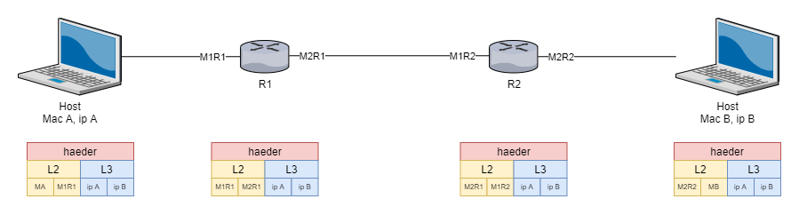

# Ejercicios propuesto en clase - 13/09/2021

## Consigna

_Obtener una red para:_
1. **5 dispositivos**
2. **20 dispositivos**
3. **31 dispositivos**

> ## Fórmula General
>
> `h: cantidad de host`   
> `N: cantidad de bits`
>
> $$ h = 2^{N} - 2 $$ 
>  

__Resolución__ 

1. __5 dispositivos__  

Aplicando la fórmula general

$$ 5 = 2^{N} - 2 $$
$$ 5 + 2 = 2^{N} $$
$$ 7 = 2^{N} $$
$$ log_{2}{7} = log_{2}{2}^{N} $$
$$ log_{2}{7} = N*log_{2}{2} $$
$$ log_{2}{7} = N*1 $$
$$ 2.8 = N $$

Versión con ___ln___ para calculadoras no científicas

$$ 7 = 2^{N} $$
$$ ln{7} = ln{2}^{N} $$
$$ ln{7} = N * ln{2} $$
$$ \frac{ln7}{ln2} = N $$
$$ 2.8 = N $$

> ## En General
> $$ a = b^{N} $$
> $$ \frac{lna}{lnb} = N $$


__`N = 2.8` es el resultado teórico, por lo tanto y dado que la cantidad de bits
es discreta, se necesitarán 3 bits para 5 dispositivos, entonces pongo los 
últimos 3 bits de la máscara en 0.__

Para cualquier IP con la máscara

__Máscara__

- _Binario_: `11111111.11111111.11111111.11111000`
- _Decimal_: `255.255.255.248`
- __`x.x.x.x/29`__

Ejemplo:

__Rango__

| binario   | decimal | tipo          |
|-----------|---------|---------------|
| __`000`__ | `0`     | __red__       |
| `001`     | `1`     | host          |
| `010`     | `2`     | host          |
| `011`     | `3`     | host          |
| `100`     | `4`     | host          |
| `101`     | `5`     | host          |
| `110`     | `6`     | host          |
| __`111`__ | `7`     | __broadcast__ |


__Tabla__

| ip         | mascara           | red        | broadcast  |
|------------|-------------------|------------|------------|
| `10.1.1.x` | `255.255.255.248` | `10.1.1.0` | `10.1.1.7` |

___

## "Utilizo el mismo criterio para los otros casos"


2. __20 dispositivos__

$$ 20 = 2^{N} - 2 $$
$$ 20 + 2 = 2^{N} $$
$$ 22 = 2^{N} $$
$$ log_{2}{22} = N $$
$$ 4.45 = N $$ 

__Práctico 5 bits.__


__Máscara__

- _Binario_: `11111111.11111111.11111111.11100000`
- _Decimal_: `255.255.255.224`
- __`x.x.x.x/27`__

__Tabla__

| ip         | mascara           | red        | broadcast   |
|------------|-------------------|------------|-------------|
| `10.1.1.x` | `255.255.255.248` | `10.1.1.0` | `10.1.1.31` |

___

3. __31 dispositivos__

$$ 31 = 2^{N} - 2 $$
$$ 31 + 2 = 2^{N} $$
$$ 33 = 2^{N} $$
$$ log_{2}{33} = N $$
$$ 5.04 = N $$ 

__Práctico 6 bits.__

__Máscara__

- _Binario_: `11111111.11111111.11111111.11000000`
- _Decimal_: `255.255.255.192`
- __`x.x.x.x/26`__

__Tabla__

| ip         | mascara           | red        | broadcast   |
|------------|-------------------|------------|-------------|
| `10.1.1.x` | `255.255.255.248` | `10.1.1.0` | `10.1.1.63` |

 ___
 
 ## Ejercicio Clase 20/09/2021

 Para la ip 10.10.10.0/24
 se pide 3 subredes para 
 1. 18 host
 2. 20 host
 3. 24 host

__Solución__

Máscara: __`11111111.11111111.11111111.00000000`__

Necesito garantizar por lo menos 24 host, para ello necesito reservar para host:

$$ 24 = 2^{N}-2 $$
$$ 24 - 2 = 2^{N} $$
$$ 22 = 2^{N} $$
$$ ln{24} = ln{2}^{N} $$
$$ ln{24} = N*ln{2} $$
$$ \frac{ln{24}}{ln{2}} = N $$
$$ 4.58 = N $$

Por lo tanto necesito __5 bits para host__ y __3 bits para subred__

Mascara de red + la subred = 
- __`11111111.11111111.11111111.11100000`__  
- 255.255.255.224
- 10.10.10.0/27

Voy a poder armar 8 subredes de 30 host

| red          | primer host | último host | broadcast    |
|--------------|-------------|-------------|--------------|
| 10.10.10.0   | 1           | 30          | 10.10.10.31  |
| 10.10.10.32  | 33          | 62          | 10.10.10.63  |
| 10.10.10.64  | 65          | 94          | 10.10.10.95  |
| 10.10.10.96  | 97          | 126         | 10.10.10.127 |
| 10.10.10.128 | 129         | 158         | 10.10.10.159 |
| 10.10.10.160 | 161         | 190         | 10.10.10.191 |
| 10.10.10.192 | 193         | 222         | 10.10.10.223 |
| 10.10.10.224 | 225         | 254         | 10.10.10.255 |


___

## Ejercicios Clase 20/09/2021

1. Partiendo de la dirección de red 10.1.1.0/24 se debe brindar conectividad a tres dominios de broadcast diferentes que tienen 68, 23 y 10 dispositivos, respectivamente. Es necesario que cada uno de estos sitios sea lo más eficiente posible en la asignación de direcciones IP
	
2. Armar los headers de Capa 2 y Capa 3 para el último ejercicio, tanto en las LAN como en la WAN, teniendo en cuanta la información vista en clase


## Ejercicio 1

- IP 10.1.1.0/24
- 3 Dominios de Broadcast
    - 64 host
    - 23 host
    - 10 host


**Máscara de Red:**
- `11111111.11111111.11111111.00000000`
- `255.255.255.0`
- `10.1.1.0/24`

***Solución:***

```Dominio de Broadcast = LAN = Red```

Por lo tan traduzco 3 Dominios de Broadcast a 3 redes y debo considerar la red con mayor cantidad de host como cota mínima de host a cumplir.

- 64 host

>$$ 64 = 2^N - 2 $$
>$$ 64-2 = 2^N $$
>$$ 62 = 2^N $$
>$$ ln{62} = ln{2^N} $$
>$$ ln{62} = N * ln{2} $$
>$$ \frac{ln62}{ln2} = N $$
>$$ 5.95 = N $$

Por lo tanto necesito 6 bits de host y 2 de red, dado que con 2 bits de red voy a poder obtener 

> $$ 2^N redes = 2^2 redes = 4 redes $$

suficiente para las 3 redes solicitadas.

Entonces quedarán 4 subredes de 

> $$ \frac{256[ip]}{4[red]} = \frac{64 [ip]}{[red]} $$

**Tabla de Rangos**

| dir. de red    | primer ip de host | última ip de host | dir. de broadcast | cant host |
|----------------|-------------------|-------------------|-------------------|-----------|
| **10.1.1.0**   | 10.1.1.1          | 10.1.1.62         | **10.1.1.63**     | **62**    |
| **10.1.1.64**  | 10.1.1.65         | 10.1.1.126        | **10.1.1.127**    | 62        |
| **10.1.1.128** | 10.1.1.129        | 10.1.1.190        | **10.1.1.191**    | 62        |
| **10.1.1.192** | 10.1.1.193        | 10.1.1.254        | **10.1.1.255**    | 62        |


> ## ¿Qué pasó acá?
> Si bien se hicieron los cálculos correctamente no se pudo obtener una red de 64 host válidos. :o


**¿Es cierto qué este esquema no es válido?**  
La impresión sería que no es válido este esquema de 3 subredes de las cuales una debe tener 64 ip's para host considerando el último octeto disponible para la segmentación solicitada.


**¿Existe una solución para este problema?**  
Dadas las herramientas vistas podría parecer una solución viable agregar un bit más de host y ver como queda nuevamente la máscara,

**¿Qué pasaría si agrego un bit más de host?**

**máscara de red + máscara de subred**
- `11111111.11111111.11111111.10000000`
- `10.1.1.0/25`

Podré armar 2 redes de 128 - 2 host para lo cual podré cumplir el requisito de 64 ip's para host, pero no el de tres 3 redes por lo que debería cambiar la distribución de los bits de máscara de red y máscara de subred.

>**máscara de red + máscara de subred**
>- `11111111.11111111.11111111.10000000`
>- `|..red..|......subred......|.host.|`
>- `10.1.1.0/25`

Para esta configuración quedarían:
- 8 bits para máscara de red ___máscara default para Ip Clase A___
- 17 bits para máscara de subred ___muchas subredes___
- 7 bits para host (128 ip's) ___suficientes host___

## El esquema cumple las condiciones, pero ... ¿Es el más eficiente?
:/

## Conclusiones
1. Dado que la ip inicial es de clase A y la máscara era de 24 bits, ya se estaba haciendo subnetting con 16 bits para subredes y 8 para host, así que sin hacer nada se cumplía con las condiciones.
2. Al hacer los cálculos para determinar los bits de host no se pudo armar una subred válida.
3. En el resultado final al cambiar la máscara de subred la holgura sobre la cantidad de host parace más eficiente.

___

## Ejercicio 2

**Supuestos**
- Una capa no puede ver por encima de si misma, es decir capa 2 no sabe nada de capa 3
- Capa 3 sólo conoce direcciones de su capa (ip's) y no conoce las direcciones de capa 2 (mac address)
- El host del que parte la información conoce la ip del equipo de destino
- Las ip de origen y de destino viajan en todas las capas

